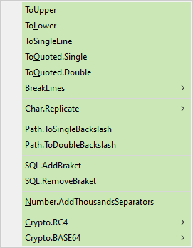
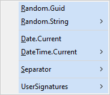
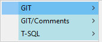
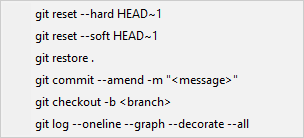

# MyWinToolbox
MyWinToolbox is a collection of AHK scripts designed to automate everyday tasks on Windows. This project includes various tools that simplify work, such as text formatters and helper scripts to streamline and accelerate repetitive tasks.

### Screenshots
Here are some screenshots showcasing the functionalities of MyWinToolbox:

- **Format menu.**

 

- **Generate string menu.**

- **Text snippets menu.**

### Note
This project uses [AutoHotkey 2.0](https://www.autohotkey.com/). For detailed information about the language and its features, please refer to the [documentation](https://www.autohotkey.com/v2/).
