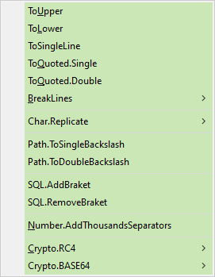
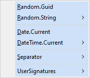
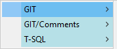
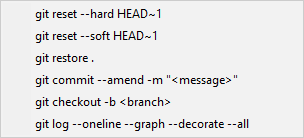

# MyWinToolbox
MyWinToolbox is a collection of AutoHotkey v2 tools for common Windows, clipboard, text, and window-management tasks. It provides two mutually exclusive profiles: `MyWinHome.ahk` and `MyWinWork.ahk`. Both include the shared functionality from `MyWinShared.ahk`.

> 📌 **Quick reference:** [MyWinToolbox Shortcut Sheet](Docs/SHORTCUTS.md) — all user-facing hotkeys, hotstrings, menus, snippets, audio/window tools, and profile-specific actions in one place.

## Requirements and startup

- Install [AutoHotkey v2](https://www.autohotkey.com/v2/).
- Run either `MyWinHome.ahk` or `MyWinWork.ahk` from the repository root. The profiles cannot run at the same time.
- Each profile reads its settings from a sibling configuration file: `MyWinHome.ahk.config` or `MyWinWork.ahk.config`.
- Shared settings are read from `MyWinShared.ahk.config`.
- Reload the active script with `Ctrl + Win + Home`; exit it with `Ctrl + Win + End`.

## Shared functionality

### Menus and hotkeys

| Shortcut | Function |
| --- | --- |
| `Ctrl + Win + F1` | Opens the bundled **PDF Shortcut Sheet**. |
| `Ctrl + Win + F` | Opens the **Format** menu. |
| `Ctrl + Win + I` | Opens the **String Generator** menu. |
| `Ctrl + Win + S` | Opens the **Text Snippets** menu. |
| `Ctrl + Win + E` | Opens the emoji menu. |
| `Ctrl + Win + D` | Pastes the current local date and time. |
| `Ctrl + Tab` | Inserts the configured number of spaces. |
| `Win + Ctrl + Page Up` | Toggles always-on-top for the active window. |
| `Win + Alt + F4` | Closes windows with the same class and title as the active window. |
| `Ctrl + Win + F4` | Closes all windows with the same class as the active window. |
| `Win + Space` | Copies the pixel color under the pointer and briefly shows a swatch. |
| `Ctrl + Win + M` | Moves selected Explorer files or folders into a newly named subdirectory. |
| `Win + Ctrl + Volume Mute` | Toggles mute for the active application's process through the native Windows Core Audio API. |

### Format menu

The Format menu transforms clipboard content and pastes the result. It provides:

- case conversion, single-line conversion, quoting, line wrapping, character replication, sorting, and thousands separators;
- conversion of paths to single, double, or normal backslashes;
- SQL helpers: add or remove brackets, create quoted lists, and produce a `VALUES` table;
- RC4 encryption/decryption using the profile's `Settings/Secret` value;
- Base64 encoding/decoding;
- conversion of selected AHK text to key sequences such as `{Enter}` and `{Tab}`.

### String generator and snippets

The String Generator creates GUIDs, random strings (16 or 32 characters), dummy text, current date/time, separators, and configured user signatures. The Text Snippets menu loads categorized snippets from `TextSnippets.json` and sends their AHK key-sequence content. The emoji menu pastes a small set of frequently used symbols.

### Built-in hotstrings

- `@=` and `@me` paste the configured email address.
- `--=` inserts a 120-character separator.
- `123k=` becomes `123000`.
- `@--`, `@->`, `@v`, `@..`, `@.o`, `@.k`, `@.>`, `@cb`, `@x`, `@!!`, `@pp`, `@oo`, and `@...` insert common punctuation and list symbols.
- In Command Prompt or Windows Terminal, `s30m=`, `s1h=`, and `s2h=` insert shutdown commands for 30 minutes, 1 hour, and 2 hours.
- In TortoiseGit dialogs, `r=` expands to `Refactoring.`.

Additional dynamic hotstrings are configured in `HotStrings.json`. They support triggers, AHK options, replacement text, enabled state, sending mode, and inclusion/exclusion scopes based on process, window class, or title.

### AutoPaste

`AutoPastes.json` defines actions that paste text when the active window matches optional `exe`, `class`, and `title` criteria. A title is matched by containment by default; use `"titleMatchMode": "equals"` for an exact match. Each window handle is processed once and an optional `delay` may be specified in milliseconds.

For ordinary entries, use `text`:

```json
{ "name": "Notepad", "exe": "notepad.exe", "text": "Hello World!" }
```

Passwords must not be stored directly in JSON. Use `passwordKey` to point to an encrypted entry in the active profile's `[Passwords]` section. AutoPaste reads the value and decrypts it using the existing RC4 key from `[Settings]` / `Secret` immediately before pasting.

```json
{
	"name": "Cisco Secure Client",
	"exe": "csc_ui.exe",
	"class": "#32770",
	"title": "Klient Cisco Secure |",
	"passwordKey": "CiscoSecurityPassword"
}
```

The profile configuration contains the corresponding encrypted value:

```ini
[Passwords]
CiscoSecurityPassword=<RC4-encrypted value>
```

To create the encrypted value, copy the password to the clipboard, press `Ctrl + Win + F`, then select **Format -> Crypto.RC4 -> Encrypt**. The encrypted value replaces the clipboard content. Do not commit personal profile values or secrets.

## Home profile

`MyWinHome.ahk` adds personal data and password shortcuts:

- `@a=` pastes the configured shipping address.
- `Ctrl + Win + P` pastes a password selected from the `[Passwords]` section. It automatically selects entries named `KeePass` when KeePass is active and `XTB` when the active browser URL matches XTB; otherwise it opens the password menu.

## Work profile

`MyWinWork.ahk` adds database and task-runner shortcuts:

- In SQL Server Management Studio, `try=`, `break=`, `nl=`, `dt=`, `sel=`, and `dirty` expand to common T-SQL templates. `sel=` uses the current clipboard content as the table name.
- `Ctrl + Win + A` enables or disables NoSleep. While enabled, it keeps the system and display awake and moves the pointer slightly after 10 minutes of idle time.
- `Ctrl + Win + T` opens the Task Runner menu, with options for NoSleep, shutdown after 1 or 2 hours, cancellation of a pending shutdown, and continuous trimming of whitespace from clipboard updates.

## Configuration files

| File | Purpose |
| --- | --- |
| `MyWinShared.ahk.config` | Shared settings such as `SpacesPerIndent` and `DummyText`. |
| `MyWinHome.ahk.config` | Home email, shipping address, RC4 secret, signatures, and encrypted passwords. |
| `MyWinWork.ahk.config` | Work email, RC4 secret, signatures, and optionally encrypted passwords used by AutoPaste. |
| `HotStrings.json` | Dynamic hotstring definitions and window scopes. |
| `TextSnippets.json` | Categorized snippet menus. |
| `AutoPastes.json` | Window-matching automatic paste rules. |

Keep profile configuration private: it can contain personal details and encrypted password values. The repository's sample configuration is intentionally generic.

### Screenshots
Here are some screenshots showcasing the functionalities of MyWinToolbox:

- **Format menu.**

 

- **Generate string menu.**



- **Text snippets menu.**



