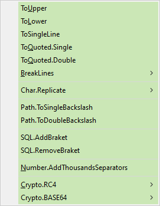
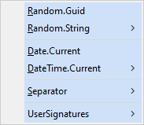
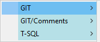
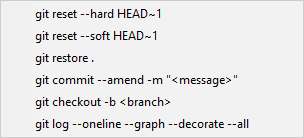

# MyWinToolbox
MyWinToolbox is a collection of AutoHotkey v2 tools for common Windows, clipboard, text, and window-management tasks. It provides two mutually exclusive profiles: `MyWinHome.ahk` and `MyWinWork.ahk`. Both include the shared functionality from `MyWinShared.ahk`.

> 📌 **Quick reference:** [MyWinToolbox Shortcut Sheet](Docs/SHORTCUTS.md) — all user-facing hotkeys, hotstrings, menus, snippets, audio/window tools, and profile-specific actions in one place.

## Requirements and startup

- Install [AutoHotkey v2](https://www.autohotkey.com/v2/).
- Run either `MyWinHome.ahk` or `MyWinWork.ahk` from the repository root. The profiles cannot run at the same time.
- Each profile reads its settings from a sibling configuration file: `MyWinHome.ahk.config` or `MyWinWork.ahk.config`.
- Shared settings are read from `MyWinShared.ahk.config`.
- `MyWinShared.ahk` is the shared composition root; implementation sections live under `Shared\Startup.ahk`, `Shared\Menus.ahk`, `Shared\Hotkeys.ahk`, and `Shared\Hotstrings.ahk`.
- Reload the active script with `Ctrl + Win + Home`; exit it with `Ctrl + Win + End`.

## Production deployment

Run `Install.ps1` from PowerShell to deploy the scripts to `C:\Program Files\MyWinToolbox`:

```powershell
.\Install.ps1
```

The installer asks for the `Home` or `Work` profile and requests administrator permission when the destination is under `Program Files`. Before copying files it stops the Windows Scheduled Task named `MyWinToolbox`; after a successful deployment it starts the task again. It deploys the selected profile entry script, `MyWinShared.ahk`, the required `Libs` and `Shared` trees, and the shortcut-sheet PDF. Files are compared by SHA-256, so unchanged files are skipped.

Production configuration is preserved: the installer never copies or overwrites `*.config`, `AutoPastes.json`, `HotStrings.json`, or `TextSnippets.json`. Create and maintain these files directly in the installation directory.

For a non-interactive deployment or a custom destination, pass parameters explicitly:

```powershell
.\Install.ps1 -Profile Home
.\Install.ps1 -Profile Work -Destination 'D:\Tools\MyWinToolbox'
```

Use `-Verify` to compare SHA-256 hashes after deployment. Restarting is automatic through the `MyWinToolbox` Scheduled Task, so `-Restart` is no longer required and is retained only for backward compatibility. If the task does not exist, deployment still succeeds and a warning is shown. The installer also deploys `Docs\SHORTCUTS.pdf`, which is required by the `Ctrl + Win + F1` shortcut.

```powershell
.\Install.ps1 -Profile Work -Verify
```


### Tests

Run the lightweight AutoHotkey regression tests with:

```powershell
.\Test.ps1
```

If AutoHotkey v2 is installed in a non-standard location, pass `-AutoHotkeyPath`. The current suite checks AutoPaste configuration/default state, legacy focus normalization, trigger-mode keys, browser URL normalization, DPAPI/legacy-RC4 password compatibility, Configurator JSON/INI validation, and configuration ZIP backup/manifest round-trips without interacting with browser UI.

## Shared functionality

### Menus and hotkeys

| Shortcut | Function |
| --- | --- |
| `Ctrl + Win + F1` | Opens the bundled **PDF Shortcut Sheet**. |
| `Ctrl + Win + F` | Opens the **Format** menu. |
| `Ctrl + Win + I` | Opens the **String Generator** menu. |
| `Ctrl + Win + S` | Opens the **Text Snippets** menu. |
| `Ctrl + Win + Shift + S` | Opens the tabbed **MyWinToolbox Configurator** for Text Snippets, HotStrings/scopes, AutoPaste, and shared/profile Settings. |
| `Ctrl + Win + E` | Opens the emoji menu. |
| `Ctrl + Win + D` | Pastes the current local date and time. |
| `Ctrl + Tab` | Inserts the configured number of spaces. |
| `Win + Ctrl + Page Up` | Toggles always-on-top for the active window. |
| `Win + Ctrl + K` | Toggles per-window KeepAlive. Every 5 minutes it briefly restores/activates the target, sends a tiny foreground mouse movement, then restores the previous cursor/focus and minimized state. |
| `Win + Alt + F4` | Closes windows with the same class and title as the active window. |
| `Ctrl + Win + F4` | Closes all windows with the same class as the active window. |
| `Win + Space` | Copies the pixel color under the pointer and briefly shows a swatch. |
| `Ctrl + Win + M` | Moves selected Explorer files or folders into a newly named subdirectory. |
| `Win + Ctrl + Volume Mute` | Toggles mute for the active application's process through the native Windows Core Audio API. |
| `Ctrl + Win + A` | Enables or disables NoSleep. While enabled, it keeps the system and display awake and moves the pointer slightly after 10 minutes of idle time. |
| `Ctrl + Win + T` | Opens the Task Runner menu, with options for NoSleep, AutoPaste, shutdown after 1 or 2 hours, cancellation of a pending shutdown, and continuous trimming of whitespace from clipboard updates. |
| `Ctrl + Win + W` | Opens **Window Toolbox** for the currently active window. |

### Window Toolbox

`Ctrl + Win + W` opens a context menu bound to the window that was active when the toolbox was invoked. It can toggle always-on-top, KeepAlive, and per-process mute; center the window; move it to left/middle/right thirds; move it to the previous or next monitor while preserving its state; copy detailed window information; close windows with the same class or the same class/title; and create a new AutoPaste rule draft from the selected window. The AutoPaste draft is opened in the existing Configurator and is not written to disk until you explicitly save it.

### Format menu

The Format menu transforms clipboard content and pastes the result. It provides:

- case conversion, single-line conversion, quoting, line wrapping, character replication, sorting, and thousands separators;
- conversion of paths to single, double, or normal backslashes;
- SQL helpers: add or remove brackets, create quoted lists, and produce a `VALUES` table;
- legacy RC4 encryption/decryption using the profile's `Settings/Secret` value;
- Base64 encoding/decoding;
- conversion of selected AHK text to key sequences such as `{Enter}` and `{Tab}`.

### String generator and snippets

The String Generator creates GUIDs, random strings (16 or 32 characters), dummy text, current date/time, separators, and configured user signatures. The Text Snippets menu loads categorized snippets from `TextSnippets.json` and sends their AHK key-sequence content. `Ctrl + Win + Shift + S` opens one tabbed **MyWinToolbox Configurator**. **Text Snippets** manages categories and snippets; **HotStrings** and **HotString Scopes** manage dynamic replacements and reusable scopes; **AutoPaste** edits window/URL matchers, trigger mode, notifications, delay and ordered `text` / `passwordKey` / `keys` / `delay` actions; **Settings** edits shared/profile INI fields, audio devices, signatures and encrypted password entries; **Backup / Restore** creates and restores versioned ZIP snapshots of the active configuration. New password values are protected with Windows DPAPI under the current Windows user; legacy RC4 values remain readable during migration. JSON and INI saves create `.bak` backups. Text Snippets and AutoPaste refresh live after Save; HotStrings and Settings require reload, so **Save + Reload** applies everything immediately. The emoji menu pastes a small set of frequently used symbols.

### Built-in hotstrings

- `@=` and `@me` paste the configured email address.
- `--=` inserts a 120-character separator.
- `123k=` becomes `123000`.
- `@--`, `@->`, `@v`, `@..`, `@.o`, `@.k`, `@.>`, `@cb`, `@x`, `@!!`, `@pp`, `@oo`, and `@...` insert common punctuation and list symbols.
- In Command Prompt or Windows Terminal, `s30m=`, `s1h=`, and `s2h=` insert shutdown commands for 30 minutes, 1 hour, and 2 hours.
- In TortoiseGit dialogs, `r=` expands to `Refactoring.`.

Additional dynamic hotstrings are configured in `HotStrings.json`. They support triggers, AHK options, replacement text, enabled state, sending mode, tags, and inclusion/exclusion scopes based on process, window class, or title. They can be edited from the **HotStrings** and **HotString Scopes** tabs of `Ctrl + Win + Shift + S`, so manual JSON editing is no longer required for normal changes.

### AutoPaste

`AutoPastes.json` defines actions that paste text when the active window matches optional `exe`, `class`, `title`, and `url` criteria. AutoPaste is **disabled by default after startup**; enable it explicitly from `Ctrl + Win + T` → **AutoPaste** when needed. Title and URL matching use containment by default; use `"titleMatchMode": "equals"` or `"urlMatchMode": "equals"` for an exact match. An optional `delay` may be specified in milliseconds.

For ordinary entries, use `text`:

```json
{ "name": "Notepad", "exe": "notepad.exe", "text": "Hello World!" }
```

Browser-specific rules can match the active tab URL. It is recommended to include the browser executable as an additional filter:

```json
{
  "name": "Example login",
  "exe": "msedge.exe",
  "url": "https://example.com/login",
  "urlMatchMode": "contains",
  "triggerMode": "oncePerWindow",
  "text": "Hello from AutoPaste"
}
```

AutoPaste reads browser URLs non-interactively through Windows UI Automation. It searches the browser's `Edit`/address-bar accessibility elements first and can also use the document value exposed by Chromium. **AutoPaste never falls back to `Ctrl+L` / `Ctrl+C`**, so a failed UIA lookup simply means the URL rule does not match; it will not steal focus or touch the clipboard. URL lookup is only attempted for rules that contain `url` and only after the other configured window criteria have matched.

By default, each rule can paste only once per top-level window (`"triggerMode": "oncePerWindow"`). You can opt into `"oncePerUrl"` for URL rules to allow one paste per distinct URL in the same browser window, or `"always"` to execute every time the 500 ms AutoPaste timer observes a match. `oncePerUrl` requires a `url` matcher. Use `always` only for actions that are intentionally safe to repeat.

For diagnostics, add `"notifyOnMatch": true` to a rule. After all configured match criteria have succeeded—and before AutoPaste attempts to paste—Windows shows a notification containing the rule name, executable, window title, and the current URL for URL-based rules. This makes it possible to distinguish a matching problem from a focus/paste problem.

```json
{
  "name": "Example login",
  "exe": "msedge.exe",
  "url": "https://example.com/login",
  "notifyOnMatch": true,
  "text": "Hello from AutoPaste"
}
```

Execution after a match is modeled as an ordered `actions` list. Each action contains exactly one operation:

- `{ "keys": "{Tab 2}" }` — send AutoHotkey key syntax, including focus/navigation keys.
- `{ "delay": 150 }` — wait the specified number of milliseconds.
- `{ "text": "value" }` — paste literal text.
- `{ "passwordKey": "ExamplePassword" }` — decrypt the named value from the active profile's `[Passwords]` section and paste it.

For example, a login form that needs keyboard navigation can be expressed as one sequence:

```json
{
  "name": "Example credentials",
  "exe": "msedge.exe",
  "url": "https://example.com/login",
  "notifyOnMatch": true,
  "actions": [
    { "keys": "{Tab 2}" },
    { "delay": 150 },
    { "passwordKey": "ExampleLogin" },
    { "keys": "{Tab}" },
    { "passwordKey": "ExamplePassword" },
    { "keys": "{Enter}" }
  ]
}
```

One action must contain one operation only. Use separate items such as `{ "keys": "{Tab}" }`, `{ "delay": 200 }` rather than combining `keys` and `delay` in one object. The top-level `delay` remains an entry-level wait performed after matching and before window activation.

AutoPaste validates the complete configuration during startup. Invalid rule fields, unsupported match modes, malformed actions, ambiguous top-level action sources, and actions with more than one operation stop registration immediately with a message that includes the rule/action location. The same validation is used by the **AutoPaste** tab in `Ctrl + Win + Shift + S`, which saves with a backup and refreshes the running AutoPaste rules while preserving their enabled/disabled state. The tab also provides **Capture window...**: MyWinToolbox temporarily hides the Configurator, lets you click the target window, then records its executable, class, title, and—when available through non-interactive UI Automation—the browser URL. **Test match...** uses the same click-to-target workflow and reports a per-matcher `✓` / `✗` diagnostic for EXE, class, title, and URL without executing the rule's actions.

The complete action list is validated before execution. If any action is invalid, AutoPaste executes none of the actions, avoiding partial form fills followed by repeated retries from the timer.

Simple rules may continue to use top-level `text` or `passwordKey`; internally these are treated like a one-item action list. The older `focus` and `focusDelay` fields are still accepted for backward compatibility, but are normalized into leading `keys` and `delay` actions. New configurations should use `actions` only.

Passwords must not be stored directly in JSON. Use `passwordKey` to point to an encrypted entry in the active profile's `[Passwords]` section. New values are stored as versioned `dpapi:v1:` envelopes protected by Windows DPAPI for the current Windows user. AutoPaste decrypts DPAPI values directly through Windows. Existing RC4 values remain supported and fall back to `[Settings]` / `Secret` until migrated.

```json
{
    "name": "Cisco Secure Client",
    "exe": "csc_ui.exe",
    "class": "#32770",
    "title": "Klient Cisco Secure |",
    "passwordKey": "CiscoSecurityPassword"
}
```

The profile configuration contains the corresponding encrypted value:

```ini
[Passwords]
CiscoSecurityPassword=dpapi:v1:<Windows-DPAPI-protected value>
```

Create or replace password values from `Ctrl + Win + Shift + S` → **Settings** → **Set plaintext...**. The plaintext is immediately protected with Windows DPAPI before it is stored in the in-memory configuration. Existing RC4 entries are shown as `[RC4]`; use **Migrate RC4 -> DPAPI** to convert them in memory, then click **Save**. The old RC4 `Secret` is needed only while legacy RC4 values remain (or when explicitly using the legacy Crypto.RC4 Format tool). Do not commit personal profile values or secrets.

## Home profile

`MyWinHome.ahk` adds personal data and password shortcuts:

- `@a=` pastes the configured shipping address.
- `Ctrl + Win + P` pastes a password selected from the `[Passwords]` section. It automatically selects entries named `KeePass` when KeePass is active and `XTB` when the active browser URL matches XTB; otherwise it opens the password menu.

## Work profile

`MyWinWork.ahk` adds database shortcuts:

- In SQL Server Management Studio, `try=`, `break=`, `nl=`, `dt=`, `sel=`, and `dirty` expand to common T-SQL templates. `sel=` uses the current clipboard content as the table name.

## Configuration files

| File | Purpose |
| --- | --- |
| `MyWinShared.ahk.config` | Shared settings such as `SpacesPerIndent`, `DummyText`, and runtime logging. |
| `MyWinHome.ahk.config` | Home email, shipping address, signatures, DPAPI-protected passwords, and an optional legacy RC4 secret for unmigrated values. |
| `MyWinWork.ahk.config` | Work email, signatures, optional DPAPI-protected passwords used by AutoPaste, and an optional legacy RC4 secret. |
| `HotStrings.json` | Dynamic hotstring definitions and window scopes. |
| `TextSnippets.json` | Categorized snippet menus. |
| `AutoPastes.json` | Window-matching automatic paste rules. |

Keep profile configuration private: it can contain personal details and encrypted password values. The repository's sample configuration is intentionally generic. The Configurator **Settings** tab edits known fields without exposing a raw INI editor. **Set plaintext...** protects new passwords with Windows DPAPI; the stored value begins with `dpapi:v1:`. The password list marks entries as `[DPAPI]`, `[RC4]`, or `[empty]`. **Migrate RC4 -> DPAPI** converts legacy values in memory using the `Secret` that was loaded with the profile; nothing is written until Save. Once no RC4 password values remain, `Secret` is no longer required for password storage. DPAPI values are intentionally tied to the Windows user context that protected them; when moving MyWinToolbox to another Windows account or machine, recreate those password values through **Set plaintext...** rather than copying the `dpapi:v1:` blobs.

### Configuration backup and restore

The Configurator **Backup / Restore** tab creates ZIP snapshots under `Documents\MyWinToolbox\Backups`. A snapshot contains the active profile `.config`, `MyWinShared.ahk.config`, `TextSnippets.json`, `HotStrings.json`, `AutoPastes.json`, and a versioned manifest. Missing optional JSON files are skipped. Backup operates on files already saved to disk, so pending Configurator edits must be saved first.

Restore accepts only backups whose manifest matches the currently active Home/Work profile. It extracts only whitelisted root-level configuration files, creates a separate `pre-restore` safety backup of the current on-disk configuration, then replaces files from the selected archive and reloads MyWinToolbox. Files not present in the archive are left unchanged. Writing into an installation under `Program Files` may trigger a Windows UAC prompt.

DPAPI-protected password blobs are included in backups, but they remain tied to the Windows user context that originally protected them. A ZIP can therefore restore general configuration on another machine, but DPAPI password entries must be recreated there through **Set plaintext...**.

Runtime diagnostics are written to `%LOCALAPPDATA%\MyWinToolbox\MyWinToolbox.log` (rotated at 2 MB). Set `[Logging] Debug = true` in `MyWinShared.ahk.config` for additional debug-level entries. Logging failures are intentionally non-fatal.

### Screenshots
Here are some screenshots showcasing the functionalities of MyWinToolbox:

- **Format menu.**

 

- **Generate string menu.**



- **Text snippets menu.**



